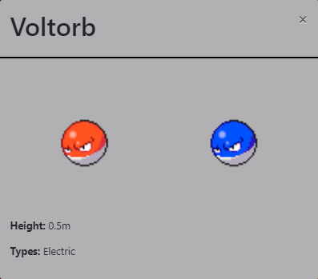

# Project Title: 
Pokédex Application

## Deployed Site
https://atmackenzie51.github.io/Pokedex-Application/

## Description: 
This is an introduction project with JavaScript that populates a Pokédex from an external API. The user can click a Pokémon name from a list of the original 150 Pokémon released in 1996 and a modal will show some basic info of the Pokémon as well as its ‘shiny’ variant.

## Technologies Used: 
HTML, CSS, JavaScript, jQuery, Bootstrap, Ajax (asynchronous JavaScript and XML)

## Reasoning in my design choice
I am an avid Pokémon fan and enjoy to ‘shiny hunt’ which is why I included the shiny variant as well. The challenge it imposed was that it required more CSS formatting to make both images centered on the modal, as well as change the placement of the Pokémon’s information. As a user, someone who is ‘shiny hunting’ typically will want to look at the Pokémon to see if the shiny variant would be one they would like to add to their collection, being able to see both images side by side really helps in this effort.

I chose to go with rows of 6 Pokémon for the largest screen because typically Pokémon are in groups of 3, to the user it would be a little strange to start a new line in the midst of a Pokémon evolution. However, not all Pokémon are in groups of 3, so there will be instances where an evolution of 2 or 3 will be broken up by the 6 limit per line. This will also be seen as the screen size gets smaller.

## Lessons Learned
The modals proved to be difficult for me. The logic to get them to function in JavaScript proved hard to understand. Additionally, I think it would have been better for me to name my functions something easier to follow. In some cases I was using pokemonList and listPokemon and I could not keep them straight in my head. 